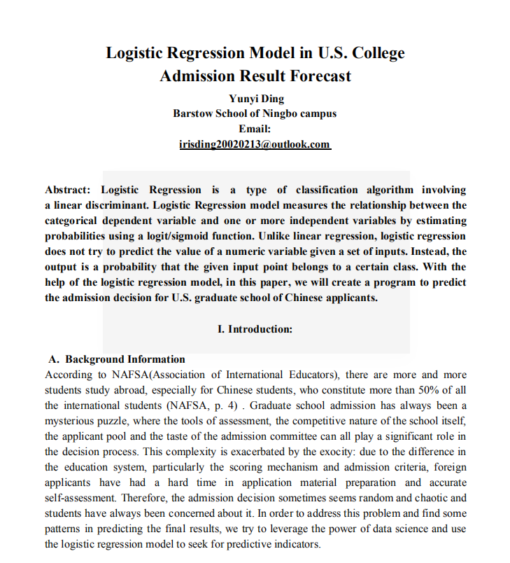

# Logistic Regression Model in U.S. College Admission Result Forecast

Abstract: Logistic Regression is a type of classification algorithm involving
a linear discriminant. Logistic Regression model measures the relationship between the
categorical dependent variable and one or more independent variables by estimating
probabilities using a logit/sigmoid function. Unlike linear regression, logistic regression
does not try to predict the value of a numeric variable given a set of inputs. Instead, the
output is a probability that the given input point belongs to a certain class. With the
help of the logistic regression model, in this paper, we will create a program to predict
the admission decision for U.S. graduate school of Chinese applicants

### Input And Output Data Information

### Data Processing
When we collect data, outliers may appear. Unlike support vector machine (SVM), Logistic
Regression result will be heavily impacted by the outliers (as all data points contribute). If
any independent variable in the regression model involves the wrong data, the probability can
change hugely.
For example, we dropped all GRE total score lower than 250 and Verbal score lower than 120
since they are unlikely to happen in reality and probably out of data entry error

1. Outlier Detection & Processing
2. Null/Missing Value Imputi
3. Turning Categorical Variables into Numerical Value/One-hot Encod
4. Dealing with Specific Issues in the Datas

### Materials and Methodology
Libraries like pandas, numpy and pyplot are quite standard python data processing/plottinglibraries that we use for basic data manipulation. Additionally, for this model, we importedthe sklearn library, which is a powerful package that contains our main algorithm of logisticregression. Also, packages like preprocessing and metrics in sklearn can help us preprocessdata and evaluate the performance of the model. For instance, the confusion matrix and itsderived metrics would be used to visualize and evaluate the model performanc
## Outlier Detection & Processing
   1. SMOTE to Handle Data Imbalan
   2. Recursive Feature Elimination (RFE)
   3. Model Summary Table & Explanation

### Results and performance

### paper

